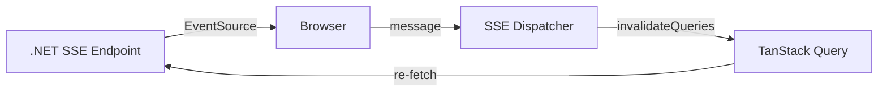

# Architecture Research: Plane Web → Flow Web

## Plane Web 当前架构

```
Component → MobX Store (混合 UI + 服务端) → Service (Axios) → Django REST API
                                  SWR (useSWR hook) ———↑
```

### 关键架构特征

1. **React Router v7（CSR）** — 路由在 `app/routes/core.ts` 中以 `layout()` + `route()` 组合配置
2. **API 层是 axios 薄包装** — `APIService` 抽象类（`withCredentials: true`），领域服务如 `CycleService extends APIService`
3. **状态管理使用 MobX** — `CoreRootStore` 聚合 ~20 个 domain store，通过 React Context 单例提供
4. **Store 直接实例化 Service** — `new CycleService()`（无 DI 容器）
5. **MobX 混合存储** — 服务端数据 + UI 状态混合在 MobX store 中

## Flow Web 目标架构

```
Layer 1 (View):      React Components → TanStack Query hooks (useQuery/useMutation)
                                              ↓
Layer 2 (Data):      Axios services (APIService base → WorkspaceService, etc.)
                                              ↓
Layer 3 (Transport): Axios instance with JWT interceptor → .NET API

Layer 1.5 (UI State): MobX stores — filter selections, sidebar toggle,
                      theme choice, command palette. NEVER API responses.
```

### 严格的 3 层分离

| 层        | 职责       | 技术               | 说明                        |
| --------- | ---------- | ------------------ | --------------------------- |
| View      | UI 渲染    | React 19 + TSX     | 纯展示，通过 hooks 获取数据 |
| Data      | 服务端数据 | TanStack Query v5  | 缓存、刷新、乐观更新        |
| Transport | HTTP 通信  | Axios + JWT 拦截器 | 请求/响应转换               |

### UI State（第 1.5 层）

MobX 只持有客户端 UI 状态：

- 筛选器选择（驱动 TanStack Query 参数）
- 侧边栏开/关
- 主题选择
- 命令面板状态
- 永远不做 API 调用

### SSE 实时通知



## 渐进式替换策略

Plane Web 的 API 层结构非常适合渐进替换：

```
// 当前（Plane Web）:
class CycleService extends APIService {
  async getCycleList(...): Promise<Cycle[]> {
    return this.get('/api/v1/cycles/')  // → Django REST
  }
  async getCycleDetails(...): Promise<Cycle> {
    return this.get(`/api/v1/cycles/${cycleId}/`)
  }
}

// 渐进替换：逐个方法重定向
class CycleService extends APIService {
  async getCycleList(...): Promise<Cycle[]> {
    return this.get('/yhs/v1/cycles/')  // → .NET API
  }
  // 这个方法暂时仍走 Django
  async getCycleDetails(...): Promise<Cycle> {
    return this.get(`/api/v1/cycles/${cycleId}/`)
  }
}
```

## 建议构建顺序

| Phase | Domain              | 后端完成度           | 理由             |
| ----- | ------------------- | -------------------- | ---------------- |
| 1     | 脚手架 + Auth       | ✅ Identity          | 先确保登录可用   |
| 2     | Workspace + Project | ✅ Workspace/Project | 不依赖其他模块   |
| 3     | Issues（核心）      | ✅ WorkItems         | 最复杂，尽早开始 |
| 4     | Cycles + Modules    | ✅ Cycle/Module      | 依赖 Issues      |
| 5     | Pages + Views       | ✅ Page/View         | 编辑器较复杂     |
| 6     | Notifications       | ✅ Notifications     | SSE 基础设施     |
| 7     | Analytics           | ✅ Analytics         | 最后做仪表板     |

## 关键集成点

| 集成点       | 当前（Plane）             | 目标（Flow）           |
| ------------ | ------------------------- | ---------------------- |
| API_BASE_URL | Django REST               | .NET 后端              |
| Auth         | Session Cookie + CSRF     | JWT Bearer             |
| 分页格式     | OffsetPaginator（自定义） | PlanePagedResult       |
| 错误格式     | `{"error": "msg"}`        | ProblemDetails         |
| 字段命名     | snake_case                | snake_case（全局配置） |
| CORS         | Django CORS               | ASP.NET Core CORS      |
